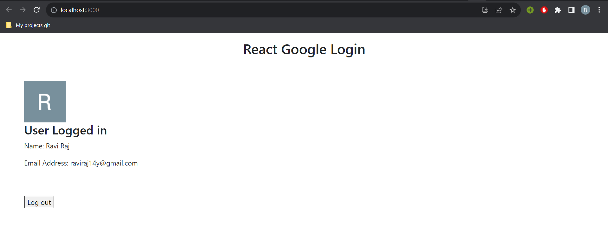

# Google Login and Admin Page

It is a basic react application that is used for google login and Admin activities

## Features

List key features of your app:

- Feature 1: Users can login into their accounts using google login
- Feature 2: Admin page can be accessed at http://localhost:3000/admin which will help to change token of bot and blocking or unblocking users

Open [http://localhost:3000]to view it in your browser.

The page will reload when you make changes.\
You may also see any lint errors in the console.

### Installation

1. Clone the repository:

   ```bash
   git clone https://github.com/ravix007/Google_Login-And-Admin_Page

   ```

2. Navigate to the project directory:

   ```bash
   cd Google_Login-And-Admin_Page


   ```

3. Install dependencies:

   ```bash
   npm install
   ```

# Run the development server

     npm start

# Snapshots of Working FrontEnd




